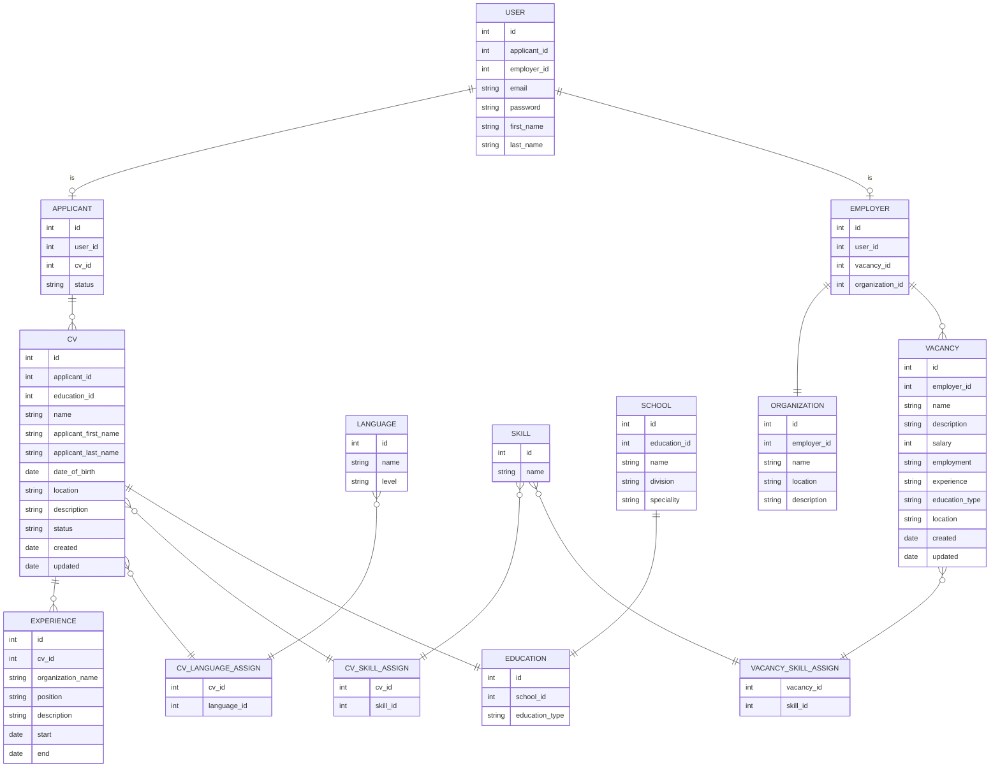

# Схема базы данных

## Нормализация

### ER диаграмма



### Функциональные зависимости
#### USER
Отношение `USER`, содержит стандартную информацию о пользователе. Имеет связь 1:1 с отношениями `APPLICANT` и `EMPLOYER`, что позволяет давать различные роли одному пользователю.

```
Relation USER:
    {id} -> password, first_name, last_name, applicant_id, employer_id
    {email} -> password, first_name, last_name, applicant_id, employer_id
```

В отношении `USER` выполняются следующие нормальные формы:
- **1 НФ** - значения атрибутов `id`, `email`, `password`, `first_name`, `last_name`, `applicant_id`, `employer_id` являются атомарными
- **2 НФ** - `password`, `first_name`, `last_name`, `applicant_id`, `employer_id` функционально зависят полностью от первичного ключа `id` и потенциального ключа `email`
- **3 НФ** - среди неключевых атрибутов `email`, `password`, `first_name`, `last_name`, `applicant_id`, `employer_id` нет функциональных зависимостей
- **НФБК** - `email` как детерминант функциональной зависимости является потенциальным ключом

___
#### APPLICANT
Отношение `APPLICANT` имеет связь 1:1 с отношением `USER` и связь 1:M с отношением `CV`. Также обладает атрибутом `status`, который говорит о статусе поиска работы соискателем.
```
Relation APPLICANT:
    {id} -> user_id, cv_id, status
```
В отношении `APPLICANT` выполняются следующие нормальные формы:
- **1 НФ** - значения атрибутов `user_id`, `cv_id`, `status` являются атомарными
- **2 НФ** - `user_id`, `cv_id`, `status` функционально зависят полностью от первичного ключа `id`
- **3 НФ** - среди неключевых атрибутов `user_id`, `cv_id`, `status` нет функциональных зависимостей
- **НФБК** - все детерминанты являются потенциальными ключами

___
#### EMPLOYER
Отношение `EMPLOYER` имеет связи:
- 1:1 с отношением `USER`
- 1:M с отношением `VACANCY`
- 1:1 с отношением `ORGANIZATION`.
```
Relation EMPLOYER:
    {id} -> user_id, vacancy_id, organization_id
```
В отношении `EMPLOYER` выполняются следующие нормальные формы:
- **1 НФ** - значения атрибутов `user_id`, `vacancy_id`, `organization_id` являются атомарными
- **2 НФ** - `user_id`, `vacancy_id`, `organization_id` функционально зависят полностью от первичного ключа `id`
- **3 НФ** - среди неключевых атрибутов `user_id`, `vacancy_id`, `organization_id` нет функциональных зависимостей
- **НФБК** - все детерминанты являются потенциальными ключами

___
#### ORGANIZATION
Отношение `ORGANIZATION` содержит основную информацию об организации. Также содержит связь 1:1 с отношением `EMPLOYER`.
```
Relation ORGANIZATION:
    {id} -> employer_id, name, location, description
```
В отношении `ORGANIZATION` выполняются следующие нормальные формы:
- **1 НФ** - значения атрибутов `employer_id`, `name`, `location`, `description` являются атомарными
- **2 НФ** - `employer_id`, `name`, `location`, `description` функционально зависят полностью от первичного ключа `id`
- **3 НФ** - среди неключевых атрибутов `employer_id`, `name`, `location`, `description` нет функциональных зависимостей
- **НФБК** - все детерминанты являются потенциальными ключами

___
#### VACANCY
Отношение `VACANCY` содержит основную информацию о вакансии. Имеет связи:
- M:1 с отношением `EMPLOYER`
- M:N с отношением `SKILL`
```
Relation VACANCY:
    {id} -> employer_id, education_type_id, name, description, salary, employment, experience, education_type, location, created, updated
```
В отношении `VACANCY` выполняются следующие нормальные формы:
- **1 НФ** - значения атрибутов `employer_id`, `name`, `description`, `salary`, `employment`, `experience`, `education_type`, `location`, `created`, `updated` являются атомарными
- **2 НФ** - `employer_id`, `name`, `description`, `salary`, `employment`, `experience`, `education_type`, `location`, `created`, `updated` функционально зависят полностью от первичного ключа `id`
- **3 НФ** - среди неключевых атрибутов `employer_id`, `name`, `description`, `salary`, `employment`, `experience`, `education_type`, `location`, `created`, `updated` нет функциональных зависимостей
- **НФБК** - все детерминанты являются потенциальными ключами

___
#### CV
Отношение `CV` содержит основную информацию о резюме. Имеет связи:
- M:1 с отношением `APPLICANT`
- 1:M с отношением `EXPERIENCE`
- M:N с отношением `LANGUAGE`
- M:N с отношением `SKILL`
- 1:1 с отношением `EDUCATION`
```
Relation CV:
    {id} -> applicant_id, education_id, name, applicant_first_name, applicant_last_name, date_of_birth, location, description, status, created, updated
```
В отношении `CV` выполняются следующие нормальные формы:
- **1 НФ** - значения атрибутов `applicant_id`, `education_id`, `name`, `applicant_first_name`, `applicant_last_name`, `date_of_birth`, `location`, `description`, `status`, `created`, `updated` являются атомарными
- **2 НФ** - `applicant_id`, `education_id`, `name`, `applicant_first_name`, `applicant_last_name`, `date_of_birth`, `location`, `description`, `status`, `created`, `updated` функционально зависят полностью от первичного ключа `id`
- **3 НФ** - среди неключевых атрибутов `applicant_id`, `education_id`, `name`, `applicant_first_name`, `applicant_last_name`, `date_of_birth`, `location`, `description`, `status`, `created`, `updated` нет функциональных зависимостей
- **НФБК** - все детерминанты являются потенциальными ключами

___
#### EXPERIENCE
Отношение `EXPERIENCE` содержит основную информацию об опыте работы. Имеет связи:
- M:1 с отношением `CV`
```
Relation EXPERIENCE:
    {id} -> cv_id, organization_name, position, description, start, end
```
В отношении `EXPERIENCE` выполняются следующие нормальные формы:
- **1 НФ** - значения атрибутов `cv_id`, `organization_name`, `position`, `description`, `start`, `end` являются атомарными
- **2 НФ** - `cv_id`, `organization_name`, `position`, `description`, `start`, `end`, `created`, `updated` функционально зависят полностью от первичного ключа `id`
- **3 НФ** - среди неключевых атрибутов `cv_id`, `organization_name`, `position`, `description`, `start`, `end`, `created`, `updated` нет функциональных зависимостей
- **НФБК** - все детерминанты являются потенциальными ключами

___
#### LANGUAGE
Отношение `LANGUAGE` содержит основную информацию об уровне знания языка. Имеет связи:
- M:N с отношением `CV`
```
Relation LANGUAGE:
    {id} -> name, level
```
В отношении `LANGUAGE` выполняются следующие нормальные формы:
- **1 НФ** - значения атрибутов `name`, `level` являются атомарными
- **2 НФ** - `name`, `level` функционально зависят полностью от первичного ключа `id`
- **3 НФ** - среди неключевых атрибутов `name`, `level` нет функциональных зависимостей
- **НФБК** - все детерминанты являются потенциальными ключами

___
#### SKILL
Отношение `SKILL` содержит основную информацию о навыках. Имеет связи:
- M:N с отношением `CV`
- M:N с отношением `VACANCY`

```
Relation SKILL:
    {id} -> name
```
В отношении `SKILL` выполняются следующие нормальные формы:
- **1 НФ** - значения атрибутов `name` являются атомарными
- **2 НФ** - `name` функционально зависят полностью от первичного ключа `id`
- **3 НФ** - среди неключевых атрибутов `name` нет функциональных зависимостей
- **НФБК** - все детерминанты являются потенциальными ключами
___
#### SCHOOL
Отношение `SCHOOL` содержит основную информацию об учебном заведении. Имеет связи:
- 1:1 с отношением `EDUCATION`
```
Relation SCHOOL:
    {id} -> education_id, name, division, speciality
```

В отношении `SCHOOL` выполняются следующие нормальные формы:
- **1 НФ** - значения атрибутов `education_id`, `name`, `division`, `speciality` являются атомарными
- **2 НФ** - `education_id`, `name`, `division`, `speciality` функционально зависят полностью от первичного ключа `id`
- **3 НФ** - среди неключевых атрибутов `education_id`, `name`, `division`, `speciality` нет функциональных зависимостей
- **НФБК** - все детерминанты являются потенциальными ключами

___
#### EDUCATION
RelaRelatiRelaОтношение `EDUCATION` содержит основную информацию об уровне образования. Имеет связи:
- 1:1 с отношением `SCHOOL`
- 1:1 с отношением `CV`
```
RelaRelatiRelation EDUCATION:
    {id} -> school_id, education_type
```

В отношении `EDUCATION` выполняются следующие нормальные формы:
- **1 НФ** - значения атрибутов `school_id`, `education_type` являются атомарными
- **2 НФ** - `school_id`, `education_type` функционально зависят полностью от первичного ключа `id`
- **3 НФ** - среди неключевых атрибутов `school_id`, `education_type` нет функциональных зависимостей
- **НФБК** - все детерминанты являются потенциальными ключами
