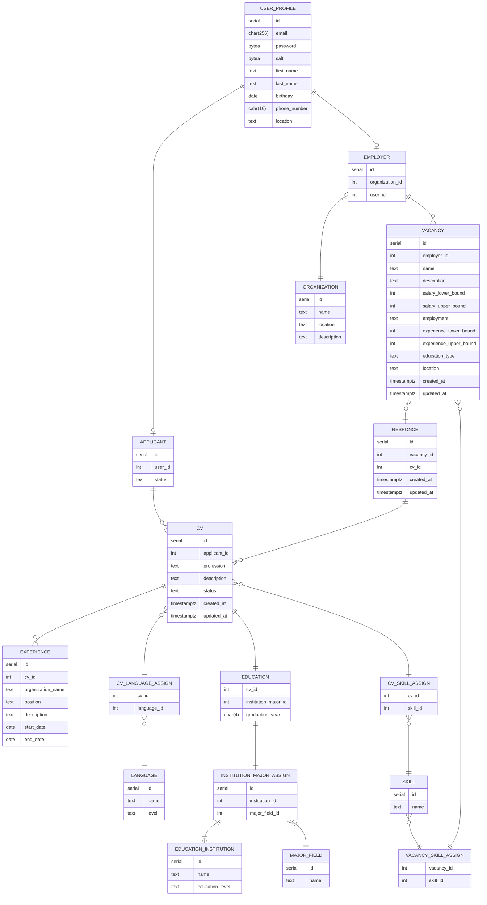

# Схема базы данных

## Нормализация

### ER диаграмма



### Функциональные зависимости

#### USER_PROFILE

Отношение `USER_PROFILE`, содержит стандартную информацию о пользователе. Имеет связь 1:1 с отношениями `APPLICANT` и `EMPLOYER`, что позволяет давать различные роли одному пользователю.

```
Relation USER_PROFILE:
    {id} -> password, salt, first_name, last_name, birthday, phone_number, location
    {email} -> password, salt, first_name, last_name, birthday, phone_number, location
```

В отношении `USER_PROFILE` выполняются следующие нормальные формы:

- **1 НФ** - значения атрибутов `id`, `email`, `password`, `salt`, `first_name`, `last_name`, `birthday`, `phone_number`, `location` являются атомарными
- **2 НФ** - `password`, `salt`, `first_name`, `last_name`, `birthday`, `phone_number`, `location` функционально зависят полностью от первичного ключа `id` и потенциального ключа `email`
- **3 НФ** - среди неключевых атрибутов `email`, `password`, `salt`, `first_name`, `last_name`, `birthday`, `phone_number`, `location` нет функциональных зависимостей
- **НФБК** - `email` как детерминант функциональной зависимости является потенциальным ключом

---

#### APPLICANT

Отношение `APPLICANT` имеет связь 1:1 с отношением `USER_PROFILE` и связь 1:M с отношением `CV`. Также обладает атрибутом `status`, который говорит о статусе поиска работы соискателем.

```
Relation APPLICANT:
    {id} -> user_id, status
```

В отношении `APPLICANT` выполняются следующие нормальные формы:

- **1 НФ** - значения атрибутов `user_id`, `status` являются атомарными
- **2 НФ** - `user_id`, `status` функционально зависят полностью от первичного ключа `id`
- **3 НФ** - среди неключевых атрибутов `user_id`, `status` нет функциональных зависимостей
- **НФБК** - все детерминанты являются потенциальными ключами

---

#### EMPLOYER

Отношение `EMPLOYER` имеет связи:

- 1:1 с отношением `USER_PROFILE`
- 1:M с отношением `VACANCY`
- M:1 с отношением `ORGANIZATION`.

```
Relation EMPLOYER:
    {id} -> organization_id, user_id
```

В отношении `EMPLOYER` выполняются следующие нормальные формы:

- **1 НФ** - значения атрибутов `organization_id`, `user_id` является атомарными
- **2 НФ** - `organization_id`, `user_id` функционально зависит полностью от первичного ключа `id`
- **3 НФ** - среди неключевых атрибутов `organization_id`, `user_id` нет функциональных зависимостей
- **НФБК** - все детерминанты являются потенциальными ключами

---

#### ORGANIZATION

Отношение `ORGANIZATION` содержит основную информацию об организации. Также содержит связь 1:M с отношением `EMPLOYER`.

```
Relation ORGANIZATION:
    {employer_id} -> name, location, description
```

В отношении `ORGANIZATION` выполняются следующие нормальные формы:

- **1 НФ** - значения атрибутов `name`, `location`, `description` являются атомарными
- **2 НФ** - `name`, `location`, `description` функционально зависят полностью от первичного ключа `employer_id`
- **3 НФ** - среди неключевых атрибутов `name`, `location`, `description` нет функциональных зависимостей
- **НФБК** - все детерминанты являются потенциальными ключами

---

#### VACANCY

Отношение `VACANCY` содержит основную информацию о вакансии. Имеет связи:

- M:1 с отношением `EMPLOYER`
- M:N с отношением `SKILL`

```
Relation VACANCY:
    {id} -> employer_id, name, description, salary_lower_bound, salary_upper_bound, employment, experience_lower_bound, experience_upper_bound, education_type, location, created_at, updated_at
```

В отношении `VACANCY` выполняются следующие нормальные формы:

- **1 НФ** - значения атрибутов `employer_id`, `name`, `description`, `salary_lower_bound`, `salary_upper_bound`, `employment`, `experience_lower_bound`, `experience_upper_bound`, `education_type`, `location`, `created_at`, `updated_at` являются атомарными
- **2 НФ** - `employer_id`, `name`, `description`, `salary_lower_bound`, `salary_upper_bound`, `employment`, `experience_lower_bound`, `experience_upper_bound`, `education_type`, `location`, `created_at`, `updated_at` функционально зависят полностью от первичного ключа `id`
- **3 НФ** - среди неключевых атрибутов `employer_id`, `name`, `description`, `salary_lower_bound`, `salary_upper_bound`, `employment`, `experience_lower_bound`, `experience_upper_bound`, `education_type`, `location`, `created_at`, `updated_at` нет функциональных зависимостей
- **НФБК** - все детерминанты являются потенциальными ключами

---

#### CV

Отношение `CV` содержит основную информацию о резюме. Имеет связи:

- M:1 с отношением `APPLICANT`
- 1:M с отношением `EXPERIENCE`
- M:N с отношением `LANGUAGE`
- M:N с отношением `SKILL`
- 1:1 с отношением `EDUCATION`

```
Relation CV:
    {id} -> applicant_id, profession, description, status, created_at, updated_at
```

В отношении `CV` выполняются следующие нормальные формы:

- **1 НФ** - значения атрибутов `applicant_id`, `profession`, `description`, `status`, `created_at`, `updated_at` являются атомарными
- **2 НФ** - `applicant_id`, `profession`, `description`, `status`, `created_at`, `updated_at` функционально зависят полностью от первичного ключа `id`
- **3 НФ** - среди неключевых атрибутов `applicant_id`, `profession`, `description`, `status`, `created_at`, `updated_at` нет функциональных зависимостей
- **НФБК** - все детерминанты являются потенциальными ключами

---

#### EXPERIENCE

Отношение `EXPERIENCE` содержит основную информацию об опыте работы. Имеет связи:

- M:1 с отношением `CV`

```
Relation EXPERIENCE:
    {id} -> cv_id, organization_name, position, description, start_date, end_date
```

В отношении `EXPERIENCE` выполняются следующие нормальные формы:

- **1 НФ** - значения атрибутов `cv_id`, `organization_name`, `position`, `description`, `start_date`, `end_date` являются атомарными
- **2 НФ** - `cv_id`, `organization_name`, `position`, `description`, `start_date`, `end_date`, `created_at`, `updated_at` функционально зависят полностью от первичного ключа `id`
- **3 НФ** - среди неключевых атрибутов `cv_id`, `organization_name`, `position`, `description`, `start_date`, `end_date`, `created_at`, `updated_at` нет функциональных зависимостей
- **НФБК** - все детерминанты являются потенциальными ключами

---

#### LANGUAGE

Отношение `LANGUAGE` содержит основную информацию об уровне знания языка. Имеет связи:

- M:N с отношением `CV`

```
Relation LANGUAGE:
    {id} -> name, level
```

В отношении `LANGUAGE` выполняются следующие нормальные формы:

- **1 НФ** - значения атрибутов `name`, `level` являются атомарными
- **2 НФ** - `name`, `level` функционально зависят полностью от первичного ключа `id`
- **3 НФ** - среди неключевых атрибутов `name`, `level` нет функциональных зависимостей
- **НФБК** - все детерминанты являются потенциальными ключами

---

#### SKILL

Отношение `SKILL` содержит основную информацию о навыках. Имеет связи:

- M:N с отношением `CV`
- M:N с отношением `VACANCY`

```
Relation SKILL:
    {id} -> name
```

В отношении `SKILL` выполняются следующие нормальные формы:

- **1 НФ** - значения атрибутов `name` являются атомарными
- **2 НФ** - `name` функционально зависят полностью от первичного ключа `id`
- **3 НФ** - среди неключевых атрибутов `name` нет функциональных зависимостей
- **НФБК** - все детерминанты являются потенциальными ключами

---

#### EDUCATION

Отношение `EDUCATION` содержит основную информацию об образовании. Имеет связи:

- 1:1 с отношением `CV`
- 1:1 с отношением `INSTITUTION_MAJOR_ASSIGN`

```
Relation EDUCATION:
    {cv_id} -> institution_major_id, graduation_year
```

В отношении `EDUCATION` выполняются следующие нормальные формы:

- **1 НФ** - значения атрибутов `institution_major_id`, `graduation_year` являются атомарными
- **2 НФ** - `institution_major_id`, `graduation_year` функционально зависят полностью от первичного ключа `cv_id`
- **3 НФ** - среди неключевых атрибутов `institution_major_id`, `graduation_year` нет функциональных зависимостей
- **НФБК** - все детерминанты являются потенциальными ключами

---

#### EDUCATION_INSTITUTION

Отношение `EDUCATION_INSTITUTION` содержит основную информацию об учебном учереждении. Имеет связи:

- M:N с отношением `MAJOR_FIELD`

```
Relation EDUCATION_INSTITUTION:
    {id} -> name, education_level
```

В отношении `EDUCATION_INSTITUTION` выполняются следующие нормальные формы:

- **1 НФ** - значения атрибутов `name`, `education_level` являются атомарными
- **2 НФ** - `name`, `education_level` функционально зависят полностью от первичного ключа `id`
- **3 НФ** - среди неключевых атрибутов `name`, `education_level` нет функциональных зависимостей
- **НФБК** - все детерминанты являются потенциальными ключами

---

#### MAJOR_FIELD

Отношение `MAJOR_FIELD` содержит основную информацию о специальности. Имеет связи:

- M:N с отношением `EDUCATION_INSTITUTION`

```
Relation MAJOR_FIELD:
    {id} -> name
```

В отношении `MAJOR_FIELD` выполняются следующие нормальные формы:

- **1 НФ** - значения атрибутов `name` являются атомарными
- **2 НФ** - `name` функционально зависят полностью от первичного ключа `id`
- **3 НФ** - среди неключевых атрибутов `name` нет функциональных зависимостей
- **НФБК** - все детерминанты являются потенциальными ключами

---

#### RESPONCE

Отношение `RESPONCE` содержит основную информацию об откликах соискателей на вакансии. Имеет связи:

- 1:M с отношением `VACANCY`
- 1:M с отношением `CV`

```
Relation RESPONCE:
    {id} -> vacancy_id, cv_id, created_at, updated_at
```

В отношении `RESPONCE` выполняются следующие нормальные формы:

- **1 НФ** - значения атрибутов `vacancy_id`, `cv_id`, `created_at`, `updated_at` являются атомарными
- **2 НФ** - `vacancy_id`, `cv_id`, `created_at`, `updated_at` функционально зависят полностью от первичного ключа `id`
- **3 НФ** - среди неключевых атрибутов `vacancy_id`, `cv_id`, `created_at`, `updated_at` нет функциональных зависимостей
- **НФБК** - все детерминанты являются потенциальными ключами
